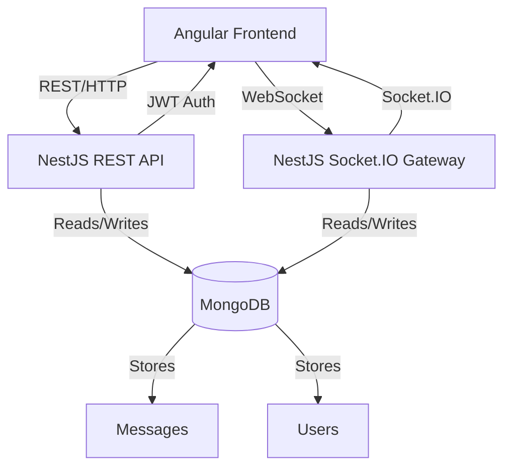

# Group Chat Application — Deliverables & Architecture

## Table of Contents
- [Project Overview](#project-overview)
- [System Architecture](#system-architecture)
- [Phases & Deliverables](#phases--deliverables)
  - [Phase 1: Monorepo Setup](#phase-1-monorepo-setup)
  - [Phase 2: Authentication](#phase-2-authentication)
  - [Phase 3: Messaging & Chat Rooms](#phase-3-messaging--chat-rooms)
  - [Phase 4: WebSocket Integration](#phase-4-websocket-integration)
  - [Phase 5: User Presence](#phase-5-user-presence)
  - [Phase 6: Dev Tools & Testing](#phase-6-dev-tools--testing)
  - [Phase 7: Docker & Deployment](#phase-7-docker--deployment)
  - [Phase 8: Azure DevOps Integration](#phase-8-azure-devops-integration)
  - [Phase 9: DigitalOcean Domain Setup](#phase-9-digitalocean-domain-setup)
- [Final Deliverables](#final-deliverables)

---

## Project Overview
A real-time group chat application built with Angular (frontend), NestJS (backend), and MongoDB, managed in an Nx monorepo. Features include authentication, public/private rooms, real-time messaging (Socket.IO), user presence, and message persistence.

---

## System Architecture

- **Frontend:** Angular 16+, RxJS, Angular Material/TailwindCSS, Socket.IO Client, JWT
- **Backend:** NestJS, MongoDB (Mongoose), Socket.IO Gateway, JWT Auth, Bcrypt, Helmet, CORS
- **Monorepo:** Nx workspace, shared libs, environment config

---

## Phases & Deliverables

### Phase 1: Monorepo Setup
- **Nx workspace** initialized
- **Angular frontend** and **NestJS backend** apps scaffolded
- **Shared libraries** for types and environment config
- **Environment configuration** for dev/prod

### Phase 2: Authentication
**Backend:**
- Auth module with register/login/profile endpoints
- JWT generation/verification (Passport, Bcrypt)
- Guards for protected routes
- User model (Mongoose)

**Frontend:**
- Auth service for login/register
- Auth interceptor and route guards
- Login/Register UI with validation

**Deliverables:**
- Secure registration and login
- JWT-based session management
- Profile endpoint

### Phase 3: Messaging & Chat Rooms
**Backend:**
- Room and Message models (Mongoose)
- Endpoints: `/rooms`, `/messages/:room` (JWT protected)

**Frontend:**
- Room list page, chat interface
- Scroll to latest message, join/create room modal

**Deliverables:**
- Persistent chat rooms and messages
- RESTful API for chat features

### Phase 4: WebSocket Integration
**Backend:**
- NestJS Gateway with Socket.IO
- Events: `joinRoom`, `leaveRoom`, `sendMessage`, `userTyping`
- Socket middleware to validate JWT

**Frontend:**
- Socket service to emit/receive events
- Real-time UI updates, typing indicator, message broadcasting

**Deliverables:**
- Real-time messaging and typing indicators
- Secure WebSocket connections

### Phase 5: User Presence
- Maintain socket-user map in backend
- Track user join/leave events
- Display online users in frontend room view

**Deliverables:**
- Online/offline user indicators
- Real-time presence updates

### Phase 6: Dev Tools & Testing
- Seed scripts for default data
- Postman collection with auth, room, message tests
- Optional unit/integration testing

**Deliverables:**
- Automated tests and seed data
- API documentation (Postman)

### Phase 7: Docker & Deployment
- Dockerize frontend and backend apps
- Optional docker-compose for local testing
- `.env` for environment config, expose ports

**Deliverables:**
- Docker images for all services
- Local development with docker-compose

### Phase 8: Azure DevOps Integration
- Build & push Docker images to Azure Container Registry (ACR)
- Deploy using Azure Kubernetes Service (AKS) or App Services
- Use GitHub Actions for CI/CD: build -> push -> deploy
- Enable monitoring via Azure Monitor

**Deliverables:**
- Automated CI/CD pipeline
- Cloud deployment and monitoring

### Phase 9: DigitalOcean Domain Setup
- Use DigitalOcean DNS for subdomain (e.g. chat.example.com)
- Create A or CNAME record pointing to Azure Load Balancer or App Service IP
- Setup HTTPS with Let's Encrypt or Azure-provided SSL certificates

**Deliverables:**
- Custom domain with HTTPS
- Publicly accessible chat app

---

## Final Deliverables
- Nx Monorepo with Angular + NestJS apps
- WebSocket and REST-based chat functionality
- Secure JWT-based auth and CORS/Helmet security
- CI/CD pipeline with GitHub Actions
- Connected subdomain hosted via Azure + DigitalOcean DNS
- README, Postman collection, and setup scripts 