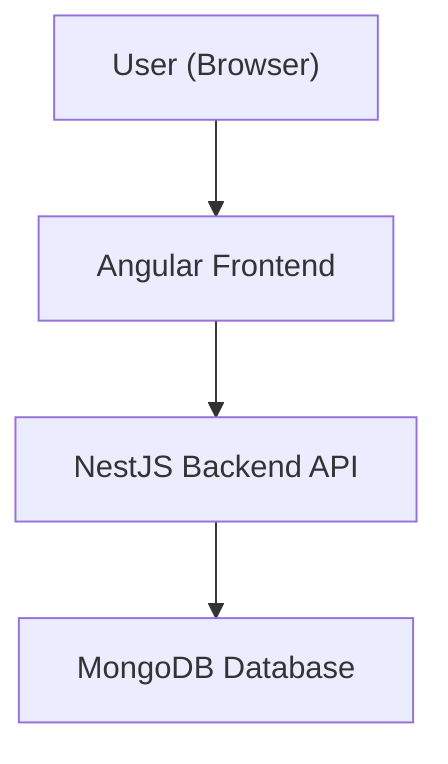

# Group Chat Application — Deliverables & Architecture

> **Tip:** To see the architecture diagram in VSCode, install the [Markdown Preview Mermaid Support](https://marketplace.visualstudio.com/items?itemName=bierner.markdown-mermaid) extension and use the Markdown preview (`Ctrl+Shift+V`).

---

## Project Overview
A full-stack, real-time group chat application built with Angular (frontend), NestJS (backend), and MongoDB. Features include authentication, public/private rooms, real-time messaging, file/image uploads, message reactions, pinning, unread badges, user list with online status, and advanced, modern UI/UX.

---

## System Architecture

---

## Feature List
- User registration and login (JWT authentication)
- Create, rename, and delete chat rooms
- Send, edit, and delete messages (only by sender)
- File/image uploads in chat messages
- Emoji reactions on messages (👍, 😂, ❤️, etc.)
- Pin/unpin messages in chat
- Unread message badges for rooms
- User list in each room with online status
- Typing indicator for active users
- Advanced, "pro-level" UI/UX:
  - Dark/light theme switcher
  - Animated message bubbles, avatars, custom scrollbars
  - Animated backgrounds, gradient borders, glowing effects
  - Floating emoji bar, context menu for message actions
  - Responsive, modern layout

---

## Final Deliverables
- Nx Monorepo with Angular + NestJS apps
- REST-based chat functionality (rooms, messages, users)
- Secure JWT-based authentication
- File/image upload support
- Emoji reactions, pinning, unread badges, user list, typing indicator
- Advanced, modern UI/UX with theme switcher
- README, file structure, and deliverables documentation
- Ready for deployment (Docker, .env, etc.) 