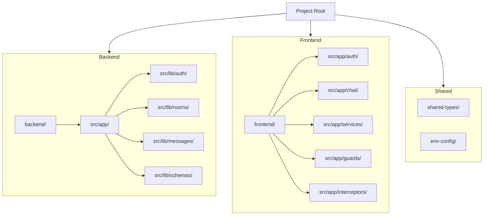

# Project File Structure (Updated)

> **Tip:** To see the project structure diagram in VSCode, install the [Markdown Preview Mermaid Support](https://marketplace.visualstudio.com/items?itemName=bierner.markdown-mermaid) extension and use the Markdown preview (`Ctrl+Shift+V`).

---

## 🚀 User Experience & Navigation (2025 Update)
- The app always opens with the **login page**. Only login and register are accessible until logged in.
- **Register here** is a button on the login page for new users.
- After login, the user is redirected to the **dashboard** and can access all app features.
- The header shows the username and profile photo (if set) on the far right, separate from navigation buttons.
- Navigation bar only shows "Dashboard" and "Rooms" when logged in; login/register links are hidden.
- All routes except login/register are protected by authentication guard.

---

## 📊 Visual Project Structure



---

## Top-Level Overview

```
.
├── backend/           # NestJS backend app
│   ├── src/
│   │   ├── app/
│   │   │   ├── auth/           # Auth controllers/services/guards
│   │   │   ├── user/           # User logic (future)
│   │   │   ├── app.controller.ts
│   │   │   ├── app.module.ts
│   │   │   └── app.service.ts
│   │   ├── assets/
│   │   ├── lib/
│   │   │   ├── auth/           # Auth logic (JWT, guards, etc.)
│   │   │   ├── rooms/          # Room controllers/services
│   │   │   ├── messages/       # Message controllers/services
│   │   │   └── schemas/        # Mongoose schemas (User, Room, Message)
│   │   └── main.ts             # Backend entry point
│   ├── .env                    # Backend environment variables
│   ├── jest.config.ts
│   ├── project.json
│   └── ... (config files)
├── frontend/          # Angular frontend app
│   ├── src/
│   │   ├── app/
│   │   │   ├── auth/
│   │   │   │   ├── login/
│   │   │   │   │   ├── login.html
│   │   │   │   │   ├── login.ts
│   │   │   │   │   └── login.css
│   │   │   │   ├── register/
│   │   │   │   │   ├── register.html
│   │   │   │   │   ├── register.ts
│   │   │   │   │   └── register.css
│   │   │   ├── chat/
│   │   │   │   ├── chat.component.ts
│   │   │   │   ├── chat.html
│   │   │   │   ├── chat.css
│   │   │   │   ├── room-list/
│   │   │   │   │   ├── room-list.ts
│   │   │   │   │   ├── room-list.html
│   │   │   │   │   └── room-list.css
│   │   │   │   ├── room-chat/
│   │   │   │   │   ├── room-chat.ts
│   │   │   │   │   ├── room-chat.html
│   │   │   │   │   └── room-chat.css
│   │   │   ├── guards/
│   │   │   │   └── auth.guard.ts
│   │   │   ├── interceptors/
│   │   │   │   ├── auth.interceptor.ts
│   │   │   │   └── index.ts
│   │   │   ├── services/
│   │   │   │   ├── auth.service.ts
│   │   │   │   └── room.service.ts
│   │   │   ├── app.config.server.ts
│   │   │   ├── app.config.ts
│   │   │   ├── app.css
│   │   │   ├── app.html
│   │   │   ├── app.routes.ts
│   │   │   ├── app.spec.ts
│   │   │   └── app.ts
│   │   ├── index.html
│   │   ├── main.server.ts
│   │   ├── main.ts
│   │   ├── server.ts
│   │   ├── styles.css
│   │   └── test-setup.ts
│   ├── public/
│   │   └── favicon.ico
│   ├── chat.html
│   ├── chat.ts
│   ├── chat.css
│   ├── rspack.config.ts
│   ├── tsconfig.server.json
│   ├── eslint.config.mjs
│   ├── jest.config.ts
│   ├── project.json
│   ├── tsconfig.app.json
│   ├── tsconfig.json
│   └── tsconfig.spec.json
├── shared-types/      # Shared TypeScript types/interfaces
│   ├── src/
│   │   ├── index.ts
│   │   └── lib/
│   │       ├── shared-types.ts
│   │       └── shared-types.spec.ts
│   ├── README.md
│   ├── eslint.config.mjs
│   ├── jest.config.ts
│   ├── project.json
│   ├── tsconfig.json
│   ├── tsconfig.lib.json
│   └── tsconfig.spec.json
├── env-config/        # Shared environment config
│   ├── src/
│   │   ├── index.ts
│   │   └── lib/
│   │       ├── env-config.ts
│   │       └── env-config.spec.ts
│   ├── README.md
│   ├── eslint.config.mjs
│   ├── jest.config.ts
│   ├── project.json
│   ├── tsconfig.json
│   ├── tsconfig.lib.json
│   └── tsconfig.spec.json
├── README.md
├── DELIVERABLES.md
├── FILE_STRUCTURE.md
├── package.json
├── nx.json
└── ... (Nx config and root files)
```

---

## What Each Folder/File Is For

### `backend/`
- **Purpose:** Contains the NestJS backend (server-side) code.
- **Key parts:**
  - `src/` — All source code for the backend app.
    - `app/` — Main application logic (controllers, services, modules, etc).
    - `lib/` — Feature modules (auth, rooms, messages, schemas)
    - `main.ts` — Entry point for the backend server.
  - `.env` — Backend environment variables (e.g., MONGO_URI)
  - `jest.config.ts` — Test configuration for backend unit tests.
  - `project.json` — Nx project config for backend.
- **What you build here:** APIs, authentication, chat logic, file uploads, etc.

### `frontend/`
- **Purpose:** Contains the Angular frontend (client-side) code.
- **Key parts:**
  - `src/` — All source code for the frontend app.
    - `app/` — Main application logic (components, pages, services, etc).
      - `auth/` — Login and register components
      - `chat/` — Chat UI, room list, room chat, etc.
      - `guards/` — Route guards
      - `interceptors/` — HTTP interceptors
      - `services/` — API and auth services
    - `main.ts` — Entry point for the frontend app.
    - `index.html` — Main HTML file.
  - `jest.config.ts` — Test configuration for frontend unit tests.
  - `project.json` — Nx project config for frontend.
- **What you build here:** User interface, chat screens, login/register forms, file uploads, etc.

### `shared-types/`
- **Purpose:** Holds TypeScript types and interfaces that are shared between frontend and backend.
- **Key parts:**
  - `src/lib/shared-types.ts` — Place your shared types/interfaces here.
- **Why:** Ensures both apps use the same data shapes (e.g., `User`, `Message`).

### `env-config/`
- **Purpose:** Shared environment configuration (e.g., constants, environment variables).
- **Key parts:**
  - `src/lib/env-config.ts` — Place your shared config here.
- **Why:** Keeps environment settings consistent across apps.

### `README.md`
- **Purpose:** Main project overview, features, and quick start guide.

### `DELIVERABLES.md`
- **Purpose:** Detailed list of project features, deliverables, and system architecture.

### `FILE_STRUCTURE.md`
- **Purpose:** (This file) Explains the file/folder structure for beginners.

### `package.json`
- **Purpose:** Lists all dependencies (libraries), scripts, and some project metadata.

### `nx.json`
- **Purpose:** Nx workspace configuration (how Nx manages your apps/libs).

### Other Nx config files
- **Examples:** `tsconfig.base.json`, `jest.config.ts`, `.editorconfig`, etc.
- **Purpose:** Manage TypeScript, testing, formatting, and other workspace-wide settings.

---

If you’re new to Nx or monorepos, just remember:
- **Apps** = things you run (frontend, backend)
- **Libs** = code you share (types, config)
- **E2E** = end-to-end tests for each app
- **Root files** = project-wide settings and documentation

If you have questions, check the main `README.md` or ask your team! 