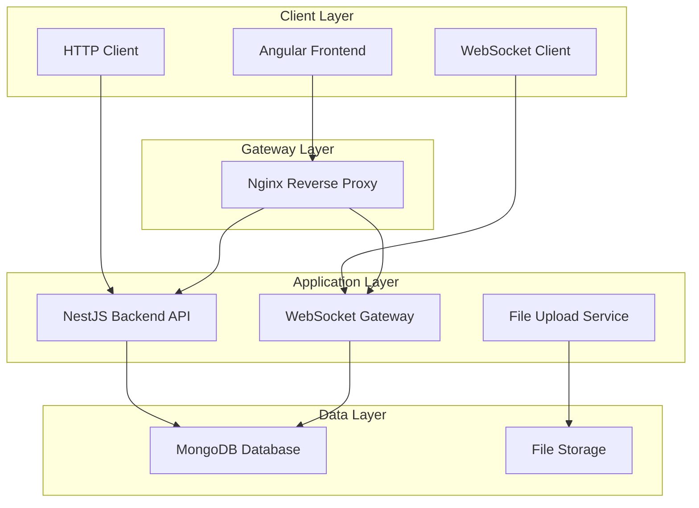

# 🚀 Group Chat Application

> **A Full-Stack Real-Time Group Chat Application**  
> Built with **Angular 16+**, **NestJS**, **MongoDB**, and **WebSocket** technology

[](https://angular.io/)
[](https://nestjs.com/)
[](https://www.mongodb.com/)
[](https://www.docker.com/)
[](https://www.typescriptlang.org/)

---

## 📋 Table of Contents

- [🎯 Project Overview](#-project-overview)
- [🏗️ Architecture & Technology Stack](#️-architecture--technology-stack)
- [🚀 Features](#-features)
- [📁 Detailed Project Structure](#-detailed-project-structure)
- [🛠️ Technology Stack Deep Dive](#️-technology-stack-deep-dive)
- [⚙️ Installation & Setup](#️-installation--setup)
- [🔧 Development Guide](#-development-guide)
- [📊 API Documentation](#-api-documentation)
- [🎨 UI/UX Features](#-uiux-features)
- [🔒 Security Features](#-security-features)
- [🧪 Testing Strategy](#-testing-strategy)
- [📦 Deployment](#-deployment)
- [🤝 Contributing](#-contributing)
- [📄 License](#-license)

---

## 🎯 Project Overview

A modern, real-time group chat application featuring advanced messaging capabilities, user authentication, file sharing, and a responsive design. Built as a monorepo using Nx workspace for optimal development experience.

### 🌟 Key Highlights
- **Real-time messaging** with WebSocket connections
- **Advanced UI/UX** with dark/light theme support
- **File & image uploads** with drag-and-drop support
- **Emoji reactions** and message pinning
- **User presence** and typing indicators
- **Responsive design** for all devices
- **JWT authentication** with role-based access
- **MongoDB integration** with Mongoose ODM

---

## 🏗️ Architecture & Technology Stack

### System Architecture



### Technology Stack

| Layer | Technology | Version | Purpose |
|-------|------------|---------|---------|
| **Frontend** | Angular | 16+ | UI Framework |
| **Frontend** | Bootstrap | 5.x | CSS Framework |
| **Frontend** | TypeScript | 5.0+ | Language |
| **Frontend** | RxJS | 7.x | Reactive Programming |
| **Backend** | NestJS | 10+ | Node.js Framework |
| **Backend** | Express | 4.x | HTTP Server |
| **Backend** | Socket.io | 4.x | WebSocket |
| **Database** | MongoDB | 6.0 | NoSQL Database |
| **ORM** | Mongoose | 7.x | MongoDB ODM |
| **Authentication** | JWT | - | Token-based Auth |
| **File Upload** | Multer | 1.4.x | File Handling |
| **Containerization** | Docker | - | Container Platform |
| **Monorepo** | Nx | 16+ | Build System |
| **Testing** | Jest | 29+ | Testing Framework |
| **Linting** | ESLint | 8+ | Code Quality |

---

## 🚀 Features

### 🔐 Authentication & User Management
- [x] **User Registration** 
- [x] **JWT-based Authentication** 
- [x] **Password Hashing** 
- [x] **Profile Management** 
- [x] **Session Management** with logout
- [x] **Route Guards** for protected pages

### 💬 Real-Time Messaging
- [x] **WebSocket Integration** for instant messaging
- [x] **Message Broadcasting** to all room members
- [x] **Typing Indicators** showing active users
- [x] **Message Editing** and deletion


### 🎨 Advanced UI/UX
- [x] **Dark/Light Theme** toggle with persistence
- [x] **Responsive Design** 
- [x] **Custom Scrollbars** and loading states


### 📁 File Management
- [x] **Drag & Drop** file uploads
- [x] **Image Preview** in chat
- [x] **File Type Validation** and size limits
- [x] **Progress Indicators** for uploads
- [x] **File Download** functionality

### 🎭 Interactive Features
- [x] **Emoji Reactions** on messages
- [x] **Message Pinning** in rooms
- [x] **User Online Status** indicators
- [x] **Room Management** (create, edit, delete)


---

## 📁 Detailed Project Structure

```
Group-Chat-App/
├── 📁 backend/                          # NestJS Backend Application
│   ├── 📁 src/
│   │   ├── 📁 app/                      # Main application module
│   │   │   ├── 📁 auth/                 # Authentication module
│   │   │   │   ├── auth.controller.ts   # Auth endpoints
│   │   │   │   ├── auth.service.ts      # Auth business logic
│   │   │   │   ├── auth.module.ts       # Auth module config
│   │   │   │   ├── jwt-auth.guard.ts    # JWT protection
│   │   │   │   └── jwt.strategy.ts      # JWT strategy
│   │   │   ├── app.controller.ts        # Root controller
│   │   │   ├── app.module.ts            # Root module
│   │   │   └── app.service.ts           # Root service
│   │   ├── 📁 lib/                      # Shared libraries
│   │   │   ├── 📁 messages/             # Messages module
│   │   │   │   ├── chat.gateway.ts      # WebSocket gateway
│   │   │   │   ├── messages.controller.ts
│   │   │   │   ├── messages.service.ts
│   │   │   │   └── messages.module.ts
│   │   │   ├── 📁 rooms/                # Rooms module
│   │   │   │   ├── rooms.controller.ts
│   │   │   │   ├── rooms.service.ts
│   │   │   │   └── rooms.module.ts
│   │   │   └── 📁 schemas/              # MongoDB schemas
│   │   │       ├── user.schema.ts       # User model
│   │   │       ├── room.schema.ts       # Room model
│   │   │       └── message.schema.ts    # Message model
│   │   ├── main.ts                      # Application entry point
│   │   └── seed.ts                      # Database seeding
│   ├── Dockerfile                       # Backend container config
│   ├── package.json                     # Backend dependencies
│   ├── tsconfig.json                    # TypeScript config
│   └── jest.config.ts                   # Testing config
│
├── 📁 frontend/                         # Angular Frontend Application
│   ├── 📁 src/
│   │   ├── 📁 app/                      # Main application
│   │   │   ├── 📁 auth/                 # Authentication components
│   │   │   │   ├── 📁 login/            # Login component
│   │   │   │   │   ├── login.html       # Login template
│   │   │   │   │   ├── login.ts         # Login logic
│   │   │   │   │   └── login.css        # Login styles
│   │   │   │   └── 📁 register/         # Registration component
│   │   │   │       ├── register.html
│   │   │   │       ├── register.ts
│   │   │   │       └── register.css
│   │   │   ├── 📁 chat/                 # Chat components
│   │   │   │   ├── 📁 room-list/        # Room list component
│   │   │   │   │   ├── room-list.html
│   │   │   │   │   ├── room-list.ts
│   │   │   │   │   └── room-list.css
│   │   │   │   ├── 📁 room-chat/        # Chat room component
│   │   │   │   │   ├── room-chat.html
│   │   │   │   │   ├── room-chat.ts
│   │   │   │   │   └── room-chat.css
│   │   │   │   ├── chat.component.ts    # Main chat component
│   │   │   │   ├── chat.html
│   │   │   │   └── chat.css
│   │   │   ├── 📁 dashboard/            # Dashboard component
│   │   │   │   ├── dashboard.html
│   │   │   │   ├── dashboard.ts
│   │   │   │   └── dashboard.css
│   │   │   ├── 📁 profile/              # Profile component
│   │   │   │   ├── profile.html
│   │   │   │   ├── profile.ts
│   │   │   │   └── profile.css
│   │   │   ├── 📁 guards/               # Route guards
│   │   │   │   └── auth.guard.ts        # Authentication guard
│   │   │   ├── 📁 interceptors/         # HTTP interceptors
│   │   │   │   ├── auth.interceptor.ts  # JWT interceptor
│   │   │   │   └── index.ts
│   │   │   ├── 📁 services/             # Application services
│   │   │   │   ├── auth.service.ts      # Authentication service
│   │   │   │   ├── room.service.ts      # Room management
│   │   │   │   ├── message.service.ts   # Message handling
│   │   │   │   ├── socket.service.ts    # WebSocket service
│   │   │   │   ├── user.service.ts      # User management
│   │   │   │   ├── settings.service.ts  # App settings
│   │   │   │   └── api-config.ts        # API configuration
│   │   │   ├── app.config.ts            # App configuration
│   │   │   ├── app.routes.ts            # Route definitions
│   │   │   ├── app.html                 # Root template
│   │   │   ├── app.ts                   # Root component
│   │   │   └── app.css                  # Global styles
│   │   ├── 📁 environments/             # Environment configs
│   │   │   ├── environment.ts           # Development
│   │   │   └── environment.prod.ts      # Production
│   │   ├── index.html                   # HTML entry point
│   │   ├── main.ts                      # Application bootstrap
│   │   ├── main.server.ts               # SSR entry point
│   │   ├── server.ts                    # Server configuration
│   │   └── styles.css                   # Global styles
│   ├── 📁 public/                       # Static assets
│   │   └── favicon.ico
│   ├── Dockerfile                       # Frontend container config
│   ├── nginx.conf                       # Nginx configuration
│   ├── package.json                     # Frontend dependencies
│   ├── tsconfig.json                    # TypeScript config
│   └── jest.config.ts                   # Testing config
│
├── 📁 shared-types/                     # Shared TypeScript types
│   ├── 📁 src/
│   │   ├── index.ts                     # Type exports
│   │   └── 📁 lib/
│   │       ├── shared-types.ts          # Common interfaces
│   │       └── shared-types.spec.ts     # Type tests
│   ├── package.json
│   └── tsconfig.json
│
├── 📁 env-config/                       # Environment configuration
│   ├── 📁 src/
│   │   ├── index.ts                     # Config exports
│   │   └── 📁 lib/
│   │       ├── env-config.ts            # Environment setup
│   │       └── env-config.spec.ts       # Config tests
│   ├── package.json
│   └── tsconfig.json
│
├── 📁 backend-e2e/                      # Backend end-to-end tests
│   ├── 📁 src/
│   │   ├── 📁 backend/
│   │   │   └── backend.spec.ts
│   │   └── 📁 support/
│   │       ├── global-setup.ts
│   │       ├── global-teardown.ts
│   │       └── test-setup.ts
│   ├── package.json
│   └── jest.config.ts
│
├── 📁 frontend-e2e/                     # Frontend end-to-end tests
│   ├── 📁 src/
│   │   └── example.spec.ts
│   ├── package.json
│   └── playwright.config.ts
│
├── 📁 docs/                             # Documentation
│   └── GroupChat.postman_collection.json # API collection
│
├── 📁 uploads/                          # File upload directory
├── docker-compose.yml                   # Multi-container setup
├── nginx.conf                           # Reverse proxy config
├── package.json                         # Root dependencies
├── nx.json                              # Nx workspace config
├── tsconfig.base.json                   # Base TypeScript config
└── README.md                            # This file
```

---

## 🛠️ Technology Stack Deep Dive

### Frontend Technologies

#### **Angular 16+**
- **Standalone Components**: Modern Angular architecture
- **Signal-based Change Detection**: Improved performance
- **Control Flow**: New template syntax for better DX


#### **Bootstrap 5**
- **Responsive Grid System**: Mobile-first approach
- **Component Library**: Pre-built UI components
- **Utility Classes**: Rapid styling capabilities
- **Custom Theming**: Dark/light mode support

#### **TypeScript 5.0+**
- **Static Typing**: Enhanced code quality
- **Advanced Types**: Union types, generics, decorators
- **ES2022 Features**: Latest JavaScript capabilities
- **Strict Mode**: Enhanced type checking

### Backend Technologies

#### **NestJS 10+**
- **Decorator-based Architecture**: Clean, readable code
- **Dependency Injection**: Modular design
- **Guards & Interceptors**: Request/response processing
- **WebSocket Gateway**: Real-time communication

#### **MongoDB 6.0**
- **Document-based Storage**: Flexible schema
- **Aggregation Pipeline**: Complex queries
- **Indexing**: Performance optimization
- **Replication**: High availability

#### **Mongoose 7.x**
- **Schema Definition**: Data validation
- **Middleware Support**: Pre/post hooks
- **Population**: Related data queries
- **Virtual Properties**: Computed fields

### Development Tools

#### **Nx Monorepo**
- **Incremental Builds**: Fast development cycles
- **Affected Commands**: Smart rebuilds
- **Code Generation**: Scaffolding tools
- **Dependency Graph**: Visual project structure

#### **Docker**
- **Multi-stage Builds**: Optimized images
- **Container Orchestration**: Easy deployment
- **Environment Isolation**: Consistent development
- **Volume Management**: Persistent data

---

## ⚙️ Installation & Setup

### Prerequisites

```bash
# Required software
Node.js 18+ (LTS recommended)
npm 9+ or yarn 1.22+
Docker & Docker Compose
Git
```

### Quick Start (Docker)

```bash
# Clone the repository
git clone <repository-url>
cd Group-Chat-App

# Start all services
docker compose up -d --build

# Access the application
# Frontend: http://localhost
# Backend API: http://localhost/api
# MongoDB: localhost:27017
```

### Development Setup

```bash
# Install dependencies
npm install

# Start MongoDB (Docker)
docker run -d --name mongodb -p 27017:27017 -v mongodata:/data/db mongo:6.0

# Environment setup
cp backend/.env.example backend/.env
# Edit backend/.env with your configuration

# Start development servers
npx nx serve backend # Backend on http://localhost:3000
npx nx serve frontend # Frontend on http://localhost:4200
```

### Environment Configuration

#### Backend (.env)
```env
# Database
MONGO_URI=mongodb://localhost:27017/group-chat

# Server
PORT=3000
NODE_ENV=development

# Authentication
JWT_SECRET=your-super-secret-jwt-key
JWT_EXPIRES_IN=7d
REFRESH_TOKEN_EXPIRES_IN=30d

# File Upload
MAX_FILE_SIZE=10485760  # 10MB
UPLOAD_PATH=./uploads

# CORS
CORS_ORIGIN=http://localhost:4200

# WebSocket
WS_PORT=3001
```

#### Frontend (environment.ts)
```typescript
export const environment = {
  production: false,
  apiUrl: 'http://localhost:3000',
  wsUrl: 'ws://localhost:3001',
  uploadUrl: 'http://localhost:3000/messages/upload'
};
```

---

## 🔧 Development Guide

### Code Style & Standards

#### TypeScript Configuration
```json
{
  "compilerOptions": {
    "strict": true,
    "noImplicitAny": true,
    "strictNullChecks": true,
    "strictFunctionTypes": true,
    "noImplicitReturns": true,
    "noFallthroughCasesInSwitch": true
  }
}
```

#### ESLint Rules
```javascript
module.exports = {
  extends: [
    '@angular-eslint/recommended',
    '@typescript-eslint/recommended'
  ],
  rules: {
    '@typescript-eslint/no-unused-vars': 'error',
    '@angular-eslint/no-empty-lifecycle-method': 'error'
  }
};
```

### Development Workflow

#### 1. Feature Development
```bash
# Create feature branch
git checkout -b feature/new-feature

# Make changes and test
npx nx test backend    # Test backend
npx nx test frontend   # Test frontend
npx nx lint backend    # Lint backend
npx nx lint frontend   # Lint frontend

# Seed database (if needed)
npm run seed           # Populate database with test data

# Commit with conventional commits
git commit -m "feat: add new chat feature"

# Push and create PR
git push origin feature/new-feature
```

#### 2. Testing Strategy
```bash
# Unit tests
npx nx test backend    # Backend unit tests
npx nx test frontend   # Frontend unit tests
npx nx test shared-types  # Shared types tests
npx nx test env-config    # Environment config tests

# E2E tests
npx nx e2e frontend-e2e   # Frontend E2E tests
npx nx e2e backend-e2e    # Backend E2E tests

# Coverage report
npx nx test backend --coverage  # Backend coverage
npx nx test frontend --coverage # Frontend coverage
```

#### 3. Code Quality
```bash
# Linting
npx nx lint backend    # Lint backend code
npx nx lint frontend   # Lint frontend code
npx nx lint shared-types  # Lint shared types
npx nx lint env-config    # Lint environment config

# Formatting (using Prettier)
npx prettier --write "**/*.{ts,js,json,html,css,scss}"

# Type checking
npx nx run-many --target=type-check --projects=backend,frontend,shared-types,env-config
```

#### 4. Current Test Status
```bash
# Backend Tests: Some tests pass, some need dependency setup
npx nx test backend    # 6 passed, 3 failed (dependency issues)

# Frontend Tests: Some tests pass, some need HTTP client setup
npx nx test frontend   # 2 passed, 4 failed (HTTP client provider issues)

# Linting: Warnings present but no critical errors
npx nx lint backend    # 27 warnings, 0 errors
npx nx lint frontend   # 14 problems (6 errors, 8 warnings)
```

#### 5. Additional Useful Commands
```bash
# Build applications
npx nx build backend   # Build backend for production
npx nx build frontend  # Build frontend for production

# Run specific projects
npx nx serve backend   # Start backend development server
npx nx serve frontend  # Start frontend development server

# Check project dependencies
npx nx graph          # Visualize project dependencies
npx nx show projects  # List all projects in workspace

# Run multiple targets
npx nx run-many --target=test --projects=backend,frontend
npx nx run-many --target=lint --projects=backend,frontend
```

### Database Management

#### MongoDB Operations
```javascript
// Connect to MongoDB
mongosh mongodb://localhost:27017/group-chat

// View collections
show collections

// Query users
db.users.find().pretty()

// Query messages
db.messages.find({ roomId: "room_id" }).sort({ createdAt: -1 })
```

#### Database Seeding
```bash
# Run seed script (recommended)
npm run seed

# Or manually
cd backend && node src/seed.ts
```

**Seeded Users:**
- **alice** / password
- **bob** / password  
- **charlie** / password

---


## 🤝 Contributing

### Development Setup
1. Fork the repository
2. Create a feature branch: `git checkout -b feature/amazing-feature`
3. Make your changes and add tests
4. Run the test suite: `npm test`
5. Commit your changes: `git commit -m 'feat: add amazing feature'`
6. Push to the branch: `git push origin feature/amazing-feature`
7. Open a Pull Request

### Code Standards
- Follow TypeScript best practices
- Write comprehensive tests
- Use conventional commit messages
- Update documentation as needed
- Follow the existing code style

### Pull Request Process
1. Update the README.md with details of changes if needed
2. Update the CHANGELOG.md with a note describing your changes
3. The PR will be merged once you have the sign-off of at least one maintainer

---

## 📄 License

This project is licensed under the MIT License - see the [LICENSE](LICENSE) file for details.

---

## 🙏 Acknowledgments

- **Angular Team** for the amazing framework
- **NestJS Team** for the robust backend framework
- **MongoDB Team** for the flexible database
- **Bootstrap Team** for the responsive CSS framework
- **Nx Team** for the monorepo tooling

---

## 📞 Support

- **Documentation**: Check the docs folder for detailed guides
- **Issues**: Report bugs and feature requests via GitHub Issues
- **Discussions**: Join the community discussions
- **Email**: Contact the maintainers directly

---

**Built with ❤️ using modern web technologies**