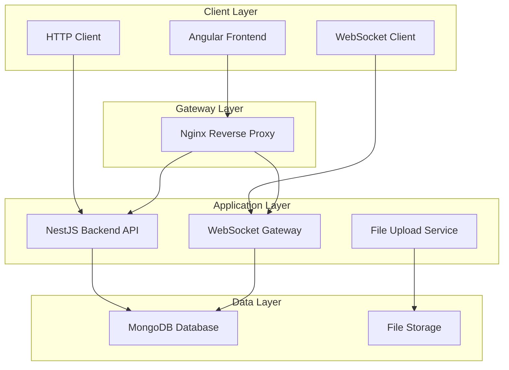

# 🚀 Group Chat Application

> **A Full-Stack Real-Time Group Chat Application**  
> Built with **Angular 16+**, **NestJS**, **MongoDB**, and **WebSocket** technology

[](https://angular.io/)
[](https://nestjs.com/)
[](https://www.mongodb.com/)
[](https://www.docker.com/)
[](https://www.typescriptlang.org/)

---

## 📋 Table of Contents

- [🎯 Project Overview](#-project-overview)
- [🏗️ Architecture & Technology Stack](#️-architecture--technology-stack)
- [🚀 Features](#-features)
- [📁 Detailed Project Structure](#-detailed-project-structure)
- [🛠️ Technology Stack Deep Dive](#️-technology-stack-deep-dive)
- [⚙️ Installation & Setup](#️-installation--setup)
- [🔧 Development Guide](#-development-guide)
- [📊 API Documentation](#-api-documentation)
- [🎨 UI/UX Features](#-uiux-features)
- [🔒 Security Features](#-security-features)
- [🧪 Testing Strategy](#-testing-strategy)
- [📦 Deployment](#-deployment)
- [🤝 Contributing](#-contributing)
- [📄 License](#-license)

---

## 🎯 Project Overview

A modern, real-time group chat application featuring advanced messaging capabilities, user authentication, file sharing, and a responsive design. Built as a monorepo using Nx workspace for optimal development experience.

### 🌟 Key Highlights
- **Real-time messaging** with WebSocket connections
- **Advanced UI/UX** with dark/light theme support
- **File & image uploads** with drag-and-drop support
- **Emoji reactions** and message pinning
- **User presence** and typing indicators
- **Responsive design** for all devices
- **JWT authentication** with role-based access
- **MongoDB integration** with Mongoose ODM

---

## 🏗️ Architecture & Technology Stack

### System Architecture



### Technology Stack

| Layer | Technology | Version | Purpose |
|-------|------------|---------|---------|
| **Frontend** | Angular | 16+ | UI Framework |
| **Frontend** | Bootstrap | 5.x | CSS Framework |
| **Frontend** | TypeScript | 5.0+ | Language |
| **Frontend** | RxJS | 7.x | Reactive Programming |
| **Backend** | NestJS | 10+ | Node.js Framework |
| **Backend** | Express | 4.x | HTTP Server |
| **Backend** | Socket.io | 4.x | WebSocket |
| **Database** | MongoDB | 6.0 | NoSQL Database |
| **ORM** | Mongoose | 7.x | MongoDB ODM |
| **Authentication** | JWT | - | Token-based Auth |
| **File Upload** | Multer | 1.4.x | File Handling |
| **Containerization** | Docker | - | Container Platform |
| **Monorepo** | Nx | 16+ | Build System |
| **Testing** | Jest | 29+ | Testing Framework |
| **Linting** | ESLint | 8+ | Code Quality |

---

## 🚀 Features

### 🔐 Authentication & User Management
- [x] **User Registration** with email validation
- [x] **JWT-based Authentication** with refresh tokens
- [x] **Password Hashing** using bcrypt
- [x] **Profile Management** with avatar uploads
- [x] **Session Management** with automatic logout
- [x] **Route Guards** for protected pages

### 💬 Real-Time Messaging
- [x] **WebSocket Integration** for instant messaging
- [x] **Message Broadcasting** to all room members
- [x] **Typing Indicators** showing active users
- [x] **Message History** with pagination
- [x] **Message Editing** and deletion
- [x] **Read Receipts** and unread counts

### 🎨 Advanced UI/UX
- [x] **Dark/Light Theme** toggle with persistence
- [x] **Responsive Design** for mobile/tablet/desktop
- [x] **Animated Components** with CSS transitions
- [x] **Custom Scrollbars** and loading states
- [x] **Toast Notifications** for user feedback
- [x] **Context Menus** for message actions

### 📁 File Management
- [x] **Drag & Drop** file uploads
- [x] **Image Preview** in chat
- [x] **File Type Validation** and size limits
- [x] **Progress Indicators** for uploads
- [x] **File Download** functionality

### 🎭 Interactive Features
- [x] **Emoji Reactions** on messages
- [x] **Message Pinning** in rooms
- [x] **User Online Status** indicators
- [x] **Room Management** (create, edit, delete)
- [x] **User Search** and filtering
- [x] **Message Search** functionality

---

## 📁 Detailed Project Structure

```
Group-Chat-App/
├── 📁 backend/                          # NestJS Backend Application
│   ├── 📁 src/
│   │   ├── 📁 app/                      # Main application module
│   │   │   ├── 📁 auth/                 # Authentication module
│   │   │   │   ├── auth.controller.ts   # Auth endpoints
│   │   │   │   ├── auth.service.ts      # Auth business logic
│   │   │   │   ├── auth.module.ts       # Auth module config
│   │   │   │   ├── jwt-auth.guard.ts    # JWT protection
│   │   │   │   └── jwt.strategy.ts      # JWT strategy
│   │   │   ├── app.controller.ts        # Root controller
│   │   │   ├── app.module.ts            # Root module
│   │   │   └── app.service.ts           # Root service
│   │   ├── 📁 lib/                      # Shared libraries
│   │   │   ├── 📁 messages/             # Messages module
│   │   │   │   ├── chat.gateway.ts      # WebSocket gateway
│   │   │   │   ├── messages.controller.ts
│   │   │   │   ├── messages.service.ts
│   │   │   │   └── messages.module.ts
│   │   │   ├── 📁 rooms/                # Rooms module
│   │   │   │   ├── rooms.controller.ts
│   │   │   │   ├── rooms.service.ts
│   │   │   │   └── rooms.module.ts
│   │   │   └── 📁 schemas/              # MongoDB schemas
│   │   │       ├── user.schema.ts       # User model
│   │   │       ├── room.schema.ts       # Room model
│   │   │       └── message.schema.ts    # Message model
│   │   ├── main.ts                      # Application entry point
│   │   └── seed.ts                      # Database seeding
│   ├── Dockerfile                       # Backend container config
│   ├── package.json                     # Backend dependencies
│   ├── tsconfig.json                    # TypeScript config
│   └── jest.config.ts                   # Testing config
│
├── 📁 frontend/                         # Angular Frontend Application
│   ├── 📁 src/
│   │   ├── 📁 app/                      # Main application
│   │   │   ├── 📁 auth/                 # Authentication components
│   │   │   │   ├── 📁 login/            # Login component
│   │   │   │   │   ├── login.html       # Login template
│   │   │   │   │   ├── login.ts         # Login logic
│   │   │   │   │   └── login.css        # Login styles
│   │   │   │   └── 📁 register/         # Registration component
│   │   │   │       ├── register.html
│   │   │   │       ├── register.ts
│   │   │   │       └── register.css
│   │   │   ├── 📁 chat/                 # Chat components
│   │   │   │   ├── 📁 room-list/        # Room list component
│   │   │   │   │   ├── room-list.html
│   │   │   │   │   ├── room-list.ts
│   │   │   │   │   └── room-list.css
│   │   │   │   ├── 📁 room-chat/        # Chat room component
│   │   │   │   │   ├── room-chat.html
│   │   │   │   │   ├── room-chat.ts
│   │   │   │   │   └── room-chat.css
│   │   │   │   ├── chat.component.ts    # Main chat component
│   │   │   │   ├── chat.html
│   │   │   │   └── chat.css
│   │   │   ├── 📁 dashboard/            # Dashboard component
│   │   │   │   ├── dashboard.html
│   │   │   │   ├── dashboard.ts
│   │   │   │   └── dashboard.css
│   │   │   ├── 📁 profile/              # Profile component
│   │   │   │   ├── profile.html
│   │   │   │   ├── profile.ts
│   │   │   │   └── profile.css
│   │   │   ├── 📁 guards/               # Route guards
│   │   │   │   └── auth.guard.ts        # Authentication guard
│   │   │   ├── 📁 interceptors/         # HTTP interceptors
│   │   │   │   ├── auth.interceptor.ts  # JWT interceptor
│   │   │   │   └── index.ts
│   │   │   ├── 📁 services/             # Application services
│   │   │   │   ├── auth.service.ts      # Authentication service
│   │   │   │   ├── room.service.ts      # Room management
│   │   │   │   ├── message.service.ts   # Message handling
│   │   │   │   ├── socket.service.ts    # WebSocket service
│   │   │   │   ├── user.service.ts      # User management
│   │   │   │   ├── settings.service.ts  # App settings
│   │   │   │   └── api-config.ts        # API configuration
│   │   │   ├── app.config.ts            # App configuration
│   │   │   ├── app.routes.ts            # Route definitions
│   │   │   ├── app.html                 # Root template
│   │   │   ├── app.ts                   # Root component
│   │   │   └── app.css                  # Global styles
│   │   ├── 📁 environments/             # Environment configs
│   │   │   ├── environment.ts           # Development
│   │   │   └── environment.prod.ts      # Production
│   │   ├── index.html                   # HTML entry point
│   │   ├── main.ts                      # Application bootstrap
│   │   ├── main.server.ts               # SSR entry point
│   │   ├── server.ts                    # Server configuration
│   │   └── styles.css                   # Global styles
│   ├── 📁 public/                       # Static assets
│   │   └── favicon.ico
│   ├── Dockerfile                       # Frontend container config
│   ├── nginx.conf                       # Nginx configuration
│   ├── package.json                     # Frontend dependencies
│   ├── tsconfig.json                    # TypeScript config
│   └── jest.config.ts                   # Testing config
│
├── 📁 shared-types/                     # Shared TypeScript types
│   ├── 📁 src/
│   │   ├── index.ts                     # Type exports
│   │   └── 📁 lib/
│   │       ├── shared-types.ts          # Common interfaces
│   │       └── shared-types.spec.ts     # Type tests
│   ├── package.json
│   └── tsconfig.json
│
├── 📁 env-config/                       # Environment configuration
│   ├── 📁 src/
│   │   ├── index.ts                     # Config exports
│   │   └── 📁 lib/
│   │       ├── env-config.ts            # Environment setup
│   │       └── env-config.spec.ts       # Config tests
│   ├── package.json
│   └── tsconfig.json
│
├── 📁 backend-e2e/                      # Backend end-to-end tests
│   ├── 📁 src/
│   │   ├── 📁 backend/
│   │   │   └── backend.spec.ts
│   │   └── 📁 support/
│   │       ├── global-setup.ts
│   │       ├── global-teardown.ts
│   │       └── test-setup.ts
│   ├── package.json
│   └── jest.config.ts
│
├── 📁 frontend-e2e/                     # Frontend end-to-end tests
│   ├── 📁 src/
│   │   └── example.spec.ts
│   ├── package.json
│   └── playwright.config.ts
│
├── 📁 docs/                             # Documentation
│   └── GroupChat.postman_collection.json # API collection
│
├── 📁 uploads/                          # File upload directory
├── docker-compose.yml                   # Multi-container setup
├── nginx.conf                           # Reverse proxy config
├── package.json                         # Root dependencies
├── nx.json                              # Nx workspace config
├── tsconfig.base.json                   # Base TypeScript config
└── README.md                            # This file
```

---

## 🛠️ Technology Stack Deep Dive

### Frontend Technologies

#### **Angular 16+**
- **Standalone Components**: Modern Angular architecture
- **Signal-based Change Detection**: Improved performance
- **Control Flow**: New template syntax for better DX
- **Server-Side Rendering**: Angular Universal for SEO

#### **Bootstrap 5**
- **Responsive Grid System**: Mobile-first approach
- **Component Library**: Pre-built UI components
- **Utility Classes**: Rapid styling capabilities
- **Custom Theming**: Dark/light mode support

#### **TypeScript 5.0+**
- **Static Typing**: Enhanced code quality
- **Advanced Types**: Union types, generics, decorators
- **ES2022 Features**: Latest JavaScript capabilities
- **Strict Mode**: Enhanced type checking

### Backend Technologies

#### **NestJS 10+**
- **Decorator-based Architecture**: Clean, readable code
- **Dependency Injection**: Modular design
- **Guards & Interceptors**: Request/response processing
- **WebSocket Gateway**: Real-time communication
- **OpenAPI Integration**: Auto-generated API docs

#### **MongoDB 6.0**
- **Document-based Storage**: Flexible schema
- **Aggregation Pipeline**: Complex queries
- **Indexing**: Performance optimization
- **Replication**: High availability

#### **Mongoose 7.x**
- **Schema Definition**: Data validation
- **Middleware Support**: Pre/post hooks
- **Population**: Related data queries
- **Virtual Properties**: Computed fields

### Development Tools

#### **Nx Monorepo**
- **Incremental Builds**: Fast development cycles
- **Affected Commands**: Smart rebuilds
- **Code Generation**: Scaffolding tools
- **Dependency Graph**: Visual project structure

#### **Docker**
- **Multi-stage Builds**: Optimized images
- **Container Orchestration**: Easy deployment
- **Environment Isolation**: Consistent development
- **Volume Management**: Persistent data

---

## ⚙️ Installation & Setup

### Prerequisites

```bash
# Required software
Node.js 18+ (LTS recommended)
npm 9+ or yarn 1.22+
Docker & Docker Compose
Git
```

### Quick Start (Docker)

```bash
# Clone the repository
git clone <repository-url>
cd Group-Chat-App

# Start all services
docker compose up -d --build

# Access the application
# Frontend: http://localhost
# Backend API: http://localhost/api
# MongoDB: localhost:27017
```

### Development Setup

```bash
# Install dependencies
npm install

# Start MongoDB (Docker)
docker run -d --name mongodb -p 27017:27017 -v mongodata:/data/db mongo:6.0

# Environment setup
cp backend/.env.example backend/.env
# Edit backend/.env with your configuration

# Start development servers
npm run dev:backend  # Backend on http://localhost:3000
npm run dev:frontend # Frontend on http://localhost:4200
```

### Environment Configuration

#### Backend (.env)
```env
# Database
MONGO_URI=mongodb://localhost:27017/group-chat

# Server
PORT=3000
NODE_ENV=development

# Authentication
JWT_SECRET=your-super-secret-jwt-key
JWT_EXPIRES_IN=7d
REFRESH_TOKEN_EXPIRES_IN=30d

# File Upload
MAX_FILE_SIZE=10485760  # 10MB
UPLOAD_PATH=./uploads

# CORS
CORS_ORIGIN=http://localhost:4200

# WebSocket
WS_PORT=3001
```

#### Frontend (environment.ts)
```typescript
export const environment = {
  production: false,
  apiUrl: 'http://localhost:3000',
  wsUrl: 'ws://localhost:3001',
  uploadUrl: 'http://localhost:3000/messages/upload'
};
```

---

## 🔧 Development Guide

### Code Style & Standards

#### TypeScript Configuration
```json
{
  "compilerOptions": {
    "strict": true,
    "noImplicitAny": true,
    "strictNullChecks": true,
    "strictFunctionTypes": true,
    "noImplicitReturns": true,
    "noFallthroughCasesInSwitch": true
  }
}
```

#### ESLint Rules
```javascript
module.exports = {
  extends: [
    '@angular-eslint/recommended',
    '@typescript-eslint/recommended'
  ],
  rules: {
    '@typescript-eslint/no-unused-vars': 'error',
    '@angular-eslint/no-empty-lifecycle-method': 'error'
  }
};
```

### Development Workflow

#### 1. Feature Development
```bash
# Create feature branch
git checkout -b feature/new-feature

# Make changes and test
npm run test
npm run lint

# Commit with conventional commits
git commit -m "feat: add new chat feature"

# Push and create PR
git push origin feature/new-feature
```

#### 2. Testing Strategy
```bash
# Unit tests
npm run test

# E2E tests
npm run e2e

# Coverage report
npm run test:coverage
```

#### 3. Code Quality
```bash
# Linting
npm run lint

# Formatting
npm run format

# Type checking
npm run type-check
```

### Database Management

#### MongoDB Operations
```javascript
// Connect to MongoDB
mongosh mongodb://localhost:27017/group-chat

// View collections
show collections

// Query users
db.users.find().pretty()

// Query messages
db.messages.find({ roomId: "room_id" }).sort({ createdAt: -1 })
```

#### Database Seeding
```bash
# Run seed script
npm run seed

# Or manually
node backend/src/seed.js
```

---

## 📊 API Documentation

### Authentication Endpoints

#### POST /auth/register
```typescript
interface RegisterRequest {
  username: string;
  email: string;
  password: string;
}

interface RegisterResponse {
  user: {
    id: string;
    username: string;
    email: string;
  };
  token: string;
}
```

#### POST /auth/login
```typescript
interface LoginRequest {
  email: string;
  password: string;
}

interface LoginResponse {
  user: User;
  token: string;
  refreshToken: string;
}
```

### Room Management

#### GET /rooms
```typescript
interface Room {
  id: string;
  name: string;
  description?: string;
  createdBy: string;
  members: string[];
  createdAt: Date;
  updatedAt: Date;
}
```

#### POST /rooms
```typescript
interface CreateRoomRequest {
  name: string;
  description?: string;
  members?: string[];
}
```

### Messaging

#### GET /messages/:roomId
```typescript
interface Message {
  id: string;
  content: string;
  roomId: string;
  userId: string;
  user: {
    id: string;
    username: string;
    avatar?: string;
  };
  attachments?: Attachment[];
  reactions?: Reaction[];
  isPinned: boolean;
  createdAt: Date;
  updatedAt: Date;
}
```

#### POST /messages
```typescript
interface CreateMessageRequest {
  content: string;
  roomId: string;
  attachments?: File[];
}
```

### WebSocket Events

#### Client to Server
```typescript
// Join room
socket.emit('join-room', { roomId: string });

// Send message
socket.emit('send-message', {
  content: string;
  roomId: string;
  attachments?: File[];
});

// Typing indicator
socket.emit('typing', { roomId: string, isTyping: boolean });
```

#### Server to Client
```typescript
// New message
socket.on('new-message', (message: Message) => {});

// User joined
socket.on('user-joined', (user: User) => {});

// User typing
socket.on('user-typing', (data: { userId: string, isTyping: boolean }) => {});

// User left
socket.on('user-left', (userId: string) => {});
```

---

## 🎨 UI/UX Features

### Theme System
```scss
// CSS Custom Properties for theming
:root {
  --primary-color: #00eaff;
  --secondary-color: #0056b3;
  --background-color: #181c24;
  --surface-color: #232a36;
  --text-color: #e3e6ed;
  --border-color: #00eaff44;
}

// Dark theme
body.theme-dark {
  --background-color: #181c24;
  --surface-color: #232a36;
  --text-color: #e3e6ed;
}

// Light theme
body.theme-light {
  --background-color: #f8fafc;
  --surface-color: #ffffff;
  --text-color: #232a36;
}
```

### Responsive Design
```scss
// Mobile-first approach
.chat-container {
  @media (max-width: 768px) {
    flex-direction: column;
  }
  
  @media (min-width: 769px) {
    display: grid;
    grid-template-columns: 300px 1fr;
  }
}
```

### Animation System
```scss
// CSS Transitions
.message-bubble {
  transition: all 0.3s cubic-bezier(0.4, 0, 0.2, 1);
  
  &:hover {
    transform: translateY(-2px);
    box-shadow: 0 4px 20px rgba(0, 234, 255, 0.3);
  }
}

// Keyframe Animations
@keyframes slideIn {
  from {
    opacity: 0;
    transform: translateX(-20px);
  }
  to {
    opacity: 1;
    transform: translateX(0);
  }
}
```

---

## 🔒 Security Features

### Authentication Security
```typescript
// JWT Configuration
@Module({
  imports: [
    JwtModule.register({
      secret: process.env.JWT_SECRET,
      signOptions: { 
        expiresIn: '7d',
        issuer: 'group-chat-app'
      },
    }),
  ],
})
```

### Input Validation
```typescript
// DTO Validation
export class CreateMessageDto {
  @IsString()
  @MinLength(1)
  @MaxLength(1000)
  content: string;

  @IsMongoId()
  roomId: string;

  @IsOptional()
  @IsArray()
  @ValidateNested({ each: true })
  attachments?: AttachmentDto[];
}
```

### File Upload Security
```typescript
// Multer Configuration
const upload = multer({
  limits: {
    fileSize: 10 * 1024 * 1024, // 10MB
  },
  fileFilter: (req, file, cb) => {
    const allowedMimes = ['image/jpeg', 'image/png', 'image/gif'];
    if (allowedMimes.includes(file.mimetype)) {
      cb(null, true);
    } else {
      cb(new Error('Invalid file type'), false);
    }
  },
});
```

### CORS Configuration
```typescript
// NestJS CORS
app.enableCors({
  origin: process.env.CORS_ORIGIN,
  credentials: true,
  methods: ['GET', 'POST', 'PUT', 'DELETE', 'PATCH'],
  allowedHeaders: ['Content-Type', 'Authorization'],
});
```

---

## 🧪 Testing Strategy

### Unit Testing
```typescript
// Service Testing
describe('AuthService', () => {
  let service: AuthService;
  let userModel: Model<User>;

  beforeEach(async () => {
    const module = await Test.createTestingModule({
      providers: [
        AuthService,
        {
          provide: getModelToken(User.name),
          useValue: mockUserModel,
        },
      ],
    }).compile();

    service = module.get<AuthService>(AuthService);
    userModel = module.get<Model<User>>(getModelToken(User.name));
  });

  it('should validate user credentials', async () => {
    const result = await service.validateUser('test@example.com', 'password');
    expect(result).toBeDefined();
  });
});
```

### Integration Testing
```typescript
// API Testing
describe('AuthController (e2e)', () => {
  let app: INestApplication;

  beforeEach(async () => {
    const moduleFixture = await Test.createTestingModule({
      imports: [AppModule],
    }).compile();

    app = moduleFixture.createNestApplication();
    await app.init();
  });

  it('/auth/login (POST)', () => {
    return request(app.getHttpServer())
      .post('/auth/login')
      .send({ email: 'test@example.com', password: 'password' })
      .expect(200);
  });
});
```

### E2E Testing
```typescript
// Playwright Tests
test('user can send a message', async ({ page }) => {
  await page.goto('/login');
  await page.fill('[data-testid="email"]', 'test@example.com');
  await page.fill('[data-testid="password"]', 'password');
  await page.click('[data-testid="login-button"]');
  
  await page.waitForURL('/dashboard');
  await page.click('[data-testid="room-item"]');
  
  await page.fill('[data-testid="message-input"]', 'Hello, world!');
  await page.click('[data-testid="send-button"]');
  
  await expect(page.locator('[data-testid="message-content"]')).toContainText('Hello, world!');
});
```

---

## 📦 Deployment

### Docker Deployment
```yaml
# docker-compose.prod.yml
version: '3.8'
services:
  frontend:
    build:
      context: .
      dockerfile: frontend/Dockerfile
      target: production
    environment:
      - NODE_ENV=production
    ports:
      - "80:80"
    depends_on:
      - backend

  backend:
    build:
      context: .
      dockerfile: backend/Dockerfile
      target: production
    environment:
      - NODE_ENV=production
      - MONGO_URI=mongodb://mongo:27017/group-chat
    depends_on:
      - mongo

  mongo:
    image: mongo:6.0
    volumes:
      - mongodata:/data/db
    environment:
      - MONGO_INITDB_ROOT_USERNAME=admin
      - MONGO_INITDB_ROOT_PASSWORD=password

volumes:
  mongodata:
```

### Environment Variables
```bash
# Production Environment
NODE_ENV=production
MONGO_URI=mongodb://mongo:27017/group-chat
JWT_SECRET=your-production-secret
CORS_ORIGIN=https://yourdomain.com
```

### Nginx Configuration
```nginx
# nginx.conf
server {
    listen 80;
    server_name localhost;

    location / {
        root /usr/share/nginx/html;
        try_files $uri $uri/ /index.html;
    }

    location /api {
        proxy_pass http://backend:3000;
        proxy_set_header Host $host;
        proxy_set_header X-Real-IP $remote_addr;
    }

    location /socket.io {
        proxy_pass http://backend:3001;
        proxy_http_version 1.1;
        proxy_set_header Upgrade $http_upgrade;
        proxy_set_header Connection "upgrade";
    }
}
```

---

## 🤝 Contributing

### Development Setup
1. Fork the repository
2. Create a feature branch: `git checkout -b feature/amazing-feature`
3. Make your changes and add tests
4. Run the test suite: `npm test`
5. Commit your changes: `git commit -m 'feat: add amazing feature'`
6. Push to the branch: `git push origin feature/amazing-feature`
7. Open a Pull Request

### Code Standards
- Follow TypeScript best practices
- Write comprehensive tests
- Use conventional commit messages
- Update documentation as needed
- Follow the existing code style

### Pull Request Process
1. Update the README.md with details of changes if needed
2. Update the CHANGELOG.md with a note describing your changes
3. The PR will be merged once you have the sign-off of at least one maintainer

---

## 📄 License

This project is licensed under the MIT License - see the [LICENSE](LICENSE) file for details.

---

## 🙏 Acknowledgments

- **Angular Team** for the amazing framework
- **NestJS Team** for the robust backend framework
- **MongoDB Team** for the flexible database
- **Bootstrap Team** for the responsive CSS framework
- **Nx Team** for the monorepo tooling

---

## 📞 Support

- **Documentation**: Check the docs folder for detailed guides
- **Issues**: Report bugs and feature requests via GitHub Issues
- **Discussions**: Join the community discussions
- **Email**: Contact the maintainers directly

---

**Built with ❤️ using modern web technologies**