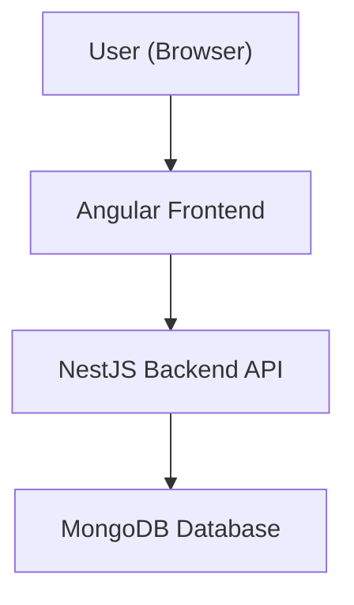
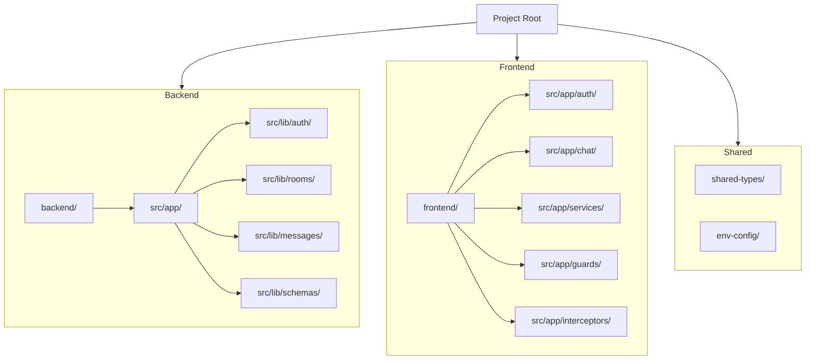

# Group Chat Application

> **Tip:** To see the architecture and structure diagrams in VSCode, install the [Markdown Preview Mermaid Support](https://marketplace.visualstudio.com/items?itemName=bierner.markdown-mermaid) extension and use the Markdown preview (`Ctrl+Shift+V`).

A full-stack, real-time group chat app built with Angular (frontend), NestJS (backend), and MongoDB. Features include authentication, chat rooms, messaging, file/image uploads, emoji reactions, pinning, unread badges, user list, typing indicator, advanced, modern UI/UX, **and dynamic page titles per route**.

---

## 🚀 User Experience & Navigation (2025 Update)
- The app always opens with the **login page**. Only login and register are accessible until logged in.
- **Register here** is a button on the login page for new users.
- After login, the user is redirected to the **dashboard** and can access all app features.
- The header shows the username and profile photo (if set) on the far right, separate from navigation buttons.
- Navigation bar only shows "Dashboard" and "Rooms" when logged in; login/register links are hidden.
- All routes except login/register are protected by authentication guard.
- **Each page now sets a unique browser tab title** (e.g., "Login - Group Chat App", "Dashboard - Group Chat App", "Room Chat - Group Chat App").

---

## 🏗️ Architecture Overview



- **Frontend:** Angular 16+, Bootstrap 5, custom CSS, JWT
- **Backend:** NestJS, MongoDB (Mongoose), JWT Auth, Multer (file uploads)
- **Monorepo:** Nx workspace, shared libs, environment config

---

## 🗂️ Project Structure Diagram



---

## 🚀 Features

| Feature                                      | Status   |
|----------------------------------------------|:--------:|
| **User registration and login (JWT auth)**   | ✅       |
| **Create, rename, and delete chat rooms**    | ✅       |
| **Send, edit, and delete messages**          | ✅       |
| **File/image uploads in chat messages**      | ✅       |
| **Emoji reactions on messages**              | ✅       |
| **Pin/unpin messages in chat**               | ✅       |
| **Unread message badges for rooms**          | ✅       |
| **User list in each room with online status**| ✅       |
| **Typing indicator for active users**        | ✅       |
| **Advanced, "pro-level" UI/UX**             | ✅       |
| &nbsp;&nbsp;• Dark/light theme switcher      | 🌗      |
| &nbsp;&nbsp;• Animated message bubbles, avatars, custom scrollbars | 💬🧑‍🎤 |
| &nbsp;&nbsp;• Animated backgrounds, gradient borders, glowing effects | 🌈✨ |
| &nbsp;&nbsp;• Floating emoji bar, context menu for message actions | 😀📋 |
| &nbsp;&nbsp;• Responsive, modern layout       | 📱💻    |

---

## 📁 Beginner-Friendly Project Structure

```
.
├── backend/           # NestJS backend app
│   ├── src/
│   │   ├── app/
│   │   │   ├── auth/           # Auth controllers/services/guards
│   │   │   ├── user/           # User logic (future)
│   │   │   ├── app.controller.ts
│   │   │   ├── app.module.ts
│   │   │   └── app.service.ts
│   │   ├── assets/
│   │   ├── lib/
│   │   │   ├── auth/           # Auth logic (JWT, guards, etc.)
│   │   │   ├── rooms/          # Room controllers/services
│   │   │   ├── messages/       # Message controllers/services
│   │   │   └── schemas/        # Mongoose schemas (User, Room, Message)
│   │   └── main.ts             # Backend entry point
│   ├── .env                    # Backend environment variables
│   ├── jest.config.ts
│   ├── project.json
│   └── ... (config files)
├── frontend/          # Angular frontend app
│   ├── src/
│   │   ├── app/
│   │   │   ├── auth/
│   │   │   │   ├── login/
│   │   │   │   │   ├── login.html
│   │   │   │   │   ├── login.ts
│   │   │   │   │   └── login.css
│   │   │   │   ├── register/
│   │   │   │   │   ├── register.html
│   │   │   │   │   ├── register.ts
│   │   │   │   │   └── register.css
│   │   │   ├── chat/
│   │   │   │   ├── chat.component.ts
│   │   │   │   ├── chat.html
│   │   │   │   ├── chat.css
│   │   │   │   ├── room-list/
│   │   │   │   │   ├── room-list.ts
│   │   │   │   │   ├── room-list.html
│   │   │   │   │   └── room-list.css
│   │   │   │   ├── room-chat/
│   │   │   │   │   ├── room-chat.ts
│   │   │   │   │   ├── room-chat.html
│   │   │   │   │   └── room-chat.css
│   │   │   ├── guards/
│   │   │   │   └── auth.guard.ts
│   │   │   ├── interceptors/
│   │   │   │   ├── auth.interceptor.ts
│   │   │   │   └── index.ts
│   │   │   ├── services/
│   │   │   │   ├── auth.service.ts
│   │   │   │   └── room.service.ts
│   │   │   ├── app.config.server.ts
│   │   │   ├── app.config.ts
│   │   │   ├── app.css
│   │   │   ├── app.html
│   │   │   ├── app.routes.ts
│   │   │   ├── app.spec.ts
│   │   │   └── app.ts
│   │   ├── index.html
│   │   ├── main.server.ts
│   │   ├── main.ts
│   │   ├── server.ts
│   │   ├── styles.css
│   │   └── test-setup.ts
│   ├── public/
│   │   └── favicon.ico
│   ├── chat.html
│   ├── chat.ts
│   ├── chat.css
│   ├── rspack.config.ts
│   ├── tsconfig.server.json
│   ├── eslint.config.mjs
│   ├── jest.config.ts
│   ├── project.json
│   ├── tsconfig.app.json
│   ├── tsconfig.json
│   └── tsconfig.spec.json
├── shared-types/      # Shared TypeScript types/interfaces
│   ├── src/
│   │   ├── index.ts
│   │   └── lib/
│   │       ├── shared-types.ts
│   │       └── shared-types.spec.ts
│   ├── README.md
│   ├── eslint.config.mjs
│   ├── jest.config.ts
│   ├── project.json
│   ├── tsconfig.json
│   ├── tsconfig.lib.json
│   └── tsconfig.spec.json
├── env-config/        # Shared environment config
│   ├── src/
│   │   ├── index.ts
│   │   └── lib/
│   │       ├── env-config.ts
│   │       └── env-config.spec.ts
│   ├── README.md
│   ├── eslint.config.mjs
│   ├── jest.config.ts
│   ├── project.json
│   ├── tsconfig.json
│   ├── tsconfig.lib.json
│   └── tsconfig.spec.json
├── README.md
├── DELIVERABLES.md
├── FILE_STRUCTURE.md
├── package.json
├── nx.json
└── ... (Nx config and root files)
```

**See `FILE_STRUCTURE.md` for a detailed explanation of every folder and file!**

---

## 📝 Dynamic Page Titles
- The browser tab title updates automatically based on the current route.
- Titles are set in `frontend/src/app/app.routes.ts` using the `data: { title: ... }` property for each route.
- The Angular app uses the `Title` service to update the tab title on navigation.
- Example: When on `/dashboard`, the tab shows "Dashboard - Group Chat App".

---

## 🛠️ Getting Started

### Prerequisites
- Node.js 18+
- npm
- Docker (for MongoDB, recommended)

### Install dependencies
```bash
npm install
```

### Start MongoDB (Docker)
```bash
docker run -d --name mongodb -p 27017:27017 -v mongodata:/data/db mongo:6.0
docker start mongodb
```

### Run the apps (Docker Compose)
#### Start all services (frontend, backend, mongo)
```bash
docker compose up -d --build
```
- **Frontend (Angular/nginx):** http://localhost (now served on port 80)
- **Backend (NestJS):** http://localhost:3000
- **MongoDB:** localhost:27017

#### (For development, you can still use Nx serve if you want hot reload)
```bash
npx nx serve backend
npx nx serve frontend
```

---

## 📝 Environment Variables
- Create `backend/.env` with:
  ```
  MONGO_URI=mongodb://localhost:27017/group-chat
  PORT=3000
  JWT_SECRET=your_jwt_secret
  ```

---

## 👩‍💻 Development Notes & Tips for Beginners
- **Frontend:** Angular 16+, Bootstrap 5, custom CSS
- **Backend:** NestJS, Mongoose, Multer (file uploads), JWT
- **Monorepo:** Managed with Nx (makes it easy to build, test, and scale)
- **Shared code:** Use `shared-types/` and `env-config/` for types and config shared between frontend and backend
- **Testing:** Use `jest.config.ts` for unit tests, and e2e folders for end-to-end tests
- **Docs:** See `DELIVERABLES.md` for features and architecture, and `FILE_STRUCTURE.md` for structure
- **Need help?** Start with the README, then check the other docs, or ask your team!

---

## 📄 Documentation
- `DELIVERABLES.md` — Features, architecture, and deliverables
- `FILE_STRUCTURE.md` — File/folder structure explained

---

## 📦 Deployment
- Docker-ready, .env-based config
- Easily deployable to any cloud or VM

---

## 🔗 Useful Links
- [Nx Documentation](https://nx.dev)
- [Angular Documentation](https://angular.io/docs)
- [NestJS Documentation](https://docs.nestjs.com/)

---

**Current status: Fully functional, production-ready group chat app!**